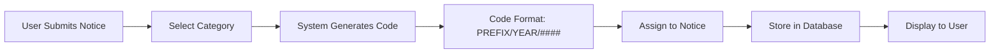

# Public Notice Reference Code System — Nova Public Notices Portal

**Document Type:** System Documentation  
**Version:** 1.0.0  
**Created:** 2026-03-18  
**Status:** Active  
**Audience:** Developers, Content Managers, Support Staff

---

## Table of Contents

1. [Overview](#overview)
2. [Reference Code Structure](#reference-code-structure)
3. [Code Generation Process](#code-generation-process)
4. [Category Prefixes](#category-prefixes)
5. [Code Assignment Workflow](#code-assignment-workflow)
6. [Value Proposition](#value-proposition)
7. [Technical Implementation](#technical-implementation)
8. [Validation Rules](#validation-rules)
9. [Examples](#examples)
10. [FAQs](#faqs)

---

## Overview

### What is a Public Notice Reference Code?

Every public notice published on the Nova Public Notices Portal is assigned a **unique reference code** (also called a reference number). This code serves as a permanent identifier that enables precise tracking, citation, and retrieval of legal notices throughout their lifecycle.

### Purpose

Reference codes provide:

1. **Unique Identification** — No two notices share the same code
2. **Legal Citation** — Courts and legal professionals reference notices by code
3. **Audit Trail** — Track notice status from submission to archival
4. **Search Optimization** — Find notices instantly by reference number
5. **Compliance** — Meet legal requirements for notice publication tracking
6. **Integration** — Connect notices across systems (WordPress, CRM, ERP, Pongrass)

---

## Reference Code Structure

### Standard Format

```
PREFIX/YEAR/SEQUENCE
```

**Components:**

| Component | Description | Format | Example |
|-----------|-------------|--------|---------|
| **PREFIX** | Category identifier | 3-4 uppercase letters | `EST` |
| **YEAR** | Publication year | 4-digit year | `2024` |
| **SEQUENCE** | Sequential number within category/year | Zero-padded 4-6 digits | `0001` |

### Examples by Category

```
EST/2024/0001      — Estate notice
TNR/2024/0042      — Tender notice
LIQ/2024/0158      — Liquor licence
CRT/2024/0089      — Court order
DIV/2024/0012      — Divorce notice
SUR/2024/0003      — Surrender of estate
ENV/2024/0067      — Environmental notice
BUS/2024/0234      — Business licence
```

### Visual Representation

```
┌─────────────────────────────────────────┐
│         EST / 2024 / 0001               │
│          │     │      │                 │
│          │     │      └─ Sequence       │
│          │     └──────── Year           │
│          └────────────── Category       │
└─────────────────────────────────────────┘
```

---

## Code Generation Process

### 1. Automatic Generation (Self-Serve Digital)

When a user submits a notice through the self-serve portal:



**Process:**

1. User selects notice category
2. System retrieves category prefix
3. System checks highest sequence number for category + year
4. System increments sequence by 1
5. System generates code: `PREFIX/YEAR/SEQUENCE`
6. Code is assigned to notice record
7. Code is displayed in submission confirmation

**Example:**
```typescript
// Last estate notice: EST/2024/0042
// New estate notice: EST/2024/0043

function generateReferenceCode(category: string, year: number): string {
  const prefix = getCategoryPrefix(category);
  const lastSequence = getLastSequence(prefix, year);
  const newSequence = lastSequence + 1;
  const paddedSequence = String(newSequence).padStart(4, '0');
  
  return `${prefix}/${year}/${paddedSequence}`;
}
```

### 2. Manual Assignment (Sales-Assisted)

For sales-assisted submissions:

1. Sales rep creates notice in admin system
2. Code is auto-generated using same logic
3. Sales rep can optionally override code (with permission)
4. Override requires reason and manager approval
5. System validates uniqueness before accepting override

### 3. Imported Notices (Pongrass/External)

For notices imported from external systems:

1. Check if external code matches Nova format
2. If yes → Validate uniqueness, adopt external code
3. If no → Generate new Nova code, store external code as metadata
4. Link external code to Nova code in database

---

## Category Prefixes

### Complete Category Prefix List

| Category | Prefix | Pattern | Example |
|----------|--------|---------|---------|
| **Estates** | `EST` | EST/YYYY/#### | EST/2024/0001 |
| **Tenders** | `TNR` | TNR/YYYY/#### | TNR/2024/0042 |
| **Liquor Licences** | `LIQ` | LIQ/YYYY/#### | LIQ/2024/0158 |
| **Court Orders** | `CRT` | CRT/YYYY/#### | CRT/2024/0089 |
| **Divorce/Antenuptial** | `DIV` | DIV/YYYY/#### | DIV/2024/0012 |
| **Insolvent Estates** | `INS` | INS/YYYY/#### | INS/2024/0034 |
| **Curatorship** | `CUR` | CUR/YYYY/#### | CUR/2024/0007 |
| **Surrender of Estate** | `SUR` | SUR/YYYY/#### | SUR/2024/0003 |
| **Environmental** | `ENV` | ENV/YYYY/#### | ENV/2024/0067 |
| **Business Licences** | `BUS` | BUS/YYYY/#### | BUS/2024/0234 |
| **Sale in Execution** | `SIE` | SIE/YYYY/#### | SIE/2024/0128 |
| **Sale of Business** | `SOB` | SOB/YYYY/#### | SOB/2024/0045 |
| **Town Planning** | `TWN` | TWN/YYYY/#### | TWN/2024/0091 |
| **Pension/Provident** | `PEN` | PEN/YYYY/#### | PEN/2024/0056 |
| **Adoptions** | `ADP` | ADP/YYYY/#### | ADP/2024/0014 |
| **Lost Documents** | `LST` | LST/YYYY/#### | LST/2024/0203 |
| **Re-registrations** | `REG` | REG/YYYY/#### | REG/2024/0087 |
| **Demolition** | `DEM` | DEM/YYYY/#### | DEM/2024/0023 |
| **Town Establishment** | `TES` | TES/YYYY/#### | TES/2024/0009 |
| **General Notices** | `GEN` | GEN/YYYY/#### | GEN/2024/0456 |
| **Name Changes** | `NAM` | NAM/YYYY/#### | NAM/2024/0078 |
| **Company Notices** | `COM` | COM/YYYY/#### | COM/2024/0134 |
| **Municipalities** | `MUN` | MUN/YYYY/#### | MUN/2024/0267 |
| **Government Gazette** | `GAZ` | GAZ/YYYY/#### | GAZ/2024/0345 |
| **Close Corporations** | `CCS` | CCS/YYYY/#### | CCS/2024/0098 |

**Total:** 25 categories with unique prefixes

### Prefix Design Rules

1. **3-4 Characters:** Short enough to remember, long enough to be unique
2. **All Uppercase:** Consistent formatting
3. **Mnemonic:** Prefix relates to category name (EST = Estates)
4. **No Ambiguity:** Avoid similar prefixes (e.g., TNR vs TNS)
5. **Future-Proof:** Reserve unused prefixes for new categories

---

## Code Assignment Workflow

### Submission to Publication Journey

```
┌─────────────────────────────────────────────────────────────┐
│                    Notice Lifecycle                         │
└─────────────────────────────────────────────────────────────┘

1. DRAFT
   └─ No reference code assigned yet

2. SUBMITTED
   └─ Reference code generated
   └─ Format: PREFIX/YEAR/DRAFT-#### (temporary)

3. PAYMENT COMPLETED
   └─ Temporary code converted to permanent
   └─ Format: PREFIX/YEAR/#### (final)

4. PENDING REVIEW (Moderation)
   └─ Permanent code assigned
   └─ Code visible in admin only

5. APPROVED
   └─ Code becomes publicly searchable
   └─ Code displayed on notice detail page

6. PUBLISHED
   └─ Code indexed for search
   └─ Code citable in legal documents

7. ARCHIVED
   └─ Code remains valid
   └─ Notice remains searchable by code
```

### Status-Based Code Visibility

| Status | Code Assigned? | Code Visible to User? | Code Searchable? |
|--------|----------------|----------------------|------------------|
| **Draft** | ❌ No | ❌ No | ❌ No |
| **Submitted** | ✅ Yes (temp) | ✅ Yes | ❌ No |
| **Paid** | ✅ Yes (final) | ✅ Yes | ❌ No |
| **Pending Review** | ✅ Yes | ✅ Yes | ❌ No |
| **Approved** | ✅ Yes | ✅ Yes | ✅ Yes (admin only) |
| **Published** | ✅ Yes | ✅ Yes | ✅ Yes (public) |
| **Rejected** | ✅ Yes | ✅ Yes | ❌ No |
| **Archived** | ✅ Yes | ✅ Yes | ✅ Yes (public) |

---

## Value Proposition

### For Users (Notice Publishers)

**1. Instant Tracking**
- Receive reference code immediately upon submission
- Track notice status using code
- No need to remember long titles or dates

**2. Professional Citation**
- Reference code accepted by courts and legal bodies
- Standardized format recognized across SA legal sector
- Permanent identifier that never changes

**3. Easy Retrieval**
- Search entire database by reference code
- Find your notice in seconds
- Share code with colleagues/clients

**4. Proof of Publication**
- Reference code serves as publication proof
- Timestamped assignment in database
- Download PDF with reference code watermark

**5. Order Management**
- Track multiple notices by code
- Link codes to invoices
- Export code lists for accounting

### For Administrators (Nova News Staff)

**1. Efficient Moderation**
- Quickly identify notices by code
- Filter admin queue by code
- Link support tickets to specific codes

**2. Audit Trail**
- Full lifecycle tracking per code
- Who approved, when, why
- Change history linked to code

**3. Duplicate Detection**
- Automatic check for duplicate submissions
- Alert if same content submitted under different code
- Merge duplicate notices

**4. Reporting & Analytics**
- Generate reports by category (prefix analysis)
- Track volume by year/category
- Identify high-traffic categories

**5. Integration Support**
- Export codes for ERP/CRM systems
- Import notices with code mapping
- API access by reference code

### For Legal Professionals & Researchers

**1. Precise Citation**
- Reference notices in court documents
- Cite specific publication by code
- No ambiguity (unlike titles which may be similar)

**2. Cross-Reference**
- Link related notices by code
- Build case history using codes
- Track estate progression (multiple notices, one estate)

**3. Historical Research**
- Access archived notices by code
- Retrieve notices from any year
- Code remains valid indefinitely

**4. Compliance Verification**
- Verify notice publication using code
- Check publication date/details
- Download official stamped PDF

### For Nova News (Business Value)

**1. Data Integrity**
- Unique identifier prevents duplicates
- Structured data enables advanced search
- Clean database architecture

**2. SEO & Discoverability**
- Reference codes indexed by Google
- Users find notices via search engines
- Increased organic traffic

**3. Premium Services**
- Offer API access by reference code
- Premium users get advanced code search
- Bulk code lookups for law firms

**4. Legal Compliance**
- Meets auditing requirements
- Demonstrates notice publication trail
- Supports legal challenges with code evidence

**5. System Integration**
- Connect WordPress, WooCommerce, PayFast via code
- Pongrass import/export using code mapping
- Future CRM/ERP integration ready

---

## Technical Implementation

### Database Schema

**Table: `notices`**

```sql
CREATE TABLE notices (
  id INT PRIMARY KEY AUTO_INCREMENT,
  reference_code VARCHAR(20) UNIQUE NOT NULL,
  category_prefix VARCHAR(4) NOT NULL,
  sequence_number INT NOT NULL,
  publication_year INT NOT NULL,
  
  -- Notice content
  title TEXT NOT NULL,
  body TEXT,
  excerpt TEXT,
  
  -- Metadata
  status ENUM('draft', 'submitted', 'paid', 'pending_review', 'approved', 'published', 'rejected', 'archived') DEFAULT 'draft',
  created_at TIMESTAMP DEFAULT CURRENT_TIMESTAMP,
  updated_at TIMESTAMP DEFAULT CURRENT_TIMESTAMP ON UPDATE CURRENT_TIMESTAMP,
  published_at TIMESTAMP NULL,
  
  -- Indexing
  INDEX idx_reference_code (reference_code),
  INDEX idx_category_year (category_prefix, publication_year),
  INDEX idx_status (status),
  INDEX idx_published_at (published_at)
);
```

**Table: `reference_sequences`**

```sql
CREATE TABLE reference_sequences (
  id INT PRIMARY KEY AUTO_INCREMENT,
  category_prefix VARCHAR(4) NOT NULL,
  year INT NOT NULL,
  last_sequence INT DEFAULT 0,
  
  UNIQUE KEY unique_category_year (category_prefix, year)
);
```

### Code Generation Function

```typescript
/**
 * Generate unique reference code for a public notice
 * 
 * @param category - Notice category (e.g., 'estates', 'tenders')
 * @param year - Publication year (defaults to current year)
 * @returns Reference code in format: PREFIX/YEAR/SEQUENCE
 */
async function generateReferenceCode(
  category: string, 
  year: number = new Date().getFullYear()
): Promise<string> {
  // Get category prefix
  const prefix = getCategoryPrefix(category);
  
  // Get next sequence number (atomic operation)
  const sequence = await incrementSequence(prefix, year);
  
  // Format sequence with leading zeros (4 digits)
  const paddedSequence = String(sequence).padStart(4, '0');
  
  // Build reference code
  const referenceCode = `${prefix}/${year}/${paddedSequence}`;
  
  // Validate uniqueness (should never fail, but check anyway)
  if (await codeExists(referenceCode)) {
    throw new Error(`Reference code ${referenceCode} already exists`);
  }
  
  return referenceCode;
}

/**
 * Get category prefix mapping
 */
function getCategoryPrefix(category: string): string {
  const prefixMap: { [key: string]: string } = {
    'estates': 'EST',
    'tenders': 'TNR',
    'liquor-licences': 'LIQ',
    'court-orders': 'CRT',
    'divorce': 'DIV',
    'insolvent-estates': 'INS',
    'curatorship': 'CUR',
    'surrender-of-estate': 'SUR',
    'environmental': 'ENV',
    'business-licences': 'BUS',
    'sale-in-execution': 'SIE',
    'sale-of-business': 'SOB',
    'town-planning': 'TWN',
    'pension-provident': 'PEN',
    'adoptions': 'ADP',
    'lost-documents': 'LST',
    're-registrations': 'REG',
    'demolition': 'DEM',
    'town-establishment': 'TES',
    'general': 'GEN',
    'name-changes': 'NAM',
    'company': 'COM',
    'municipalities': 'MUN',
    'government-gazette': 'GAZ',
    'close-corporations': 'CCS',
  };
  
  const prefix = prefixMap[category];
  
  if (!prefix) {
    throw new Error(`Unknown category: ${category}`);
  }
  
  return prefix;
}

/**
 * Atomically increment sequence number
 */
async function incrementSequence(prefix: string, year: number): Promise<number> {
  const result = await db.query(`
    INSERT INTO reference_sequences (category_prefix, year, last_sequence)
    VALUES (?, ?, 1)
    ON DUPLICATE KEY UPDATE last_sequence = last_sequence + 1
  `, [prefix, year]);
  
  const sequence = await db.query(`
    SELECT last_sequence 
    FROM reference_sequences 
    WHERE category_prefix = ? AND year = ?
  `, [prefix, year]);
  
  return sequence[0].last_sequence;
}

/**
 * Check if reference code already exists
 */
async function codeExists(referenceCode: string): Promise<boolean> {
  const result = await db.query(`
    SELECT COUNT(*) as count 
    FROM notices 
    WHERE reference_code = ?
  `, [referenceCode]);
  
  return result[0].count > 0;
}
```

### Search Implementation

```typescript
/**
 * Search notices by reference code
 * Supports full code, partial code, or just sequence number
 */
async function searchByReferenceCode(query: string): Promise<Notice[]> {
  // Normalize query (uppercase, trim)
  const normalizedQuery = query.toUpperCase().trim();
  
  // Try exact match first
  let results = await db.query(`
    SELECT * FROM notices 
    WHERE reference_code = ?
    AND status = 'published'
  `, [normalizedQuery]);
  
  if (results.length > 0) {
    return results;
  }
  
  // Try partial match (e.g., user types "EST/2024")
  results = await db.query(`
    SELECT * FROM notices 
    WHERE reference_code LIKE ?
    AND status = 'published'
    ORDER BY reference_code DESC
    LIMIT 20
  `, [`${normalizedQuery}%`]);
  
  return results;
}
```

---

## Validation Rules

### Format Validation

```typescript
/**
 * Validate reference code format
 */
function validateReferenceCode(code: string): boolean {
  // Format: PREFIX/YEAR/SEQUENCE
  // PREFIX: 3-4 uppercase letters
  // YEAR: 4 digits
  // SEQUENCE: 4-6 digits
  
  const regex = /^[A-Z]{3,4}\/\d{4}\/\d{4,6}$/;
  
  if (!regex.test(code)) {
    return false;
  }
  
  // Validate year (must be 2020 or later, not future)
  const parts = code.split('/');
  const year = parseInt(parts[1]);
  const currentYear = new Date().getFullYear();
  
  if (year < 2020 || year > currentYear) {
    return false;
  }
  
  // Validate prefix (must be known category)
  const prefix = parts[0];
  const validPrefixes = [
    'EST', 'TNR', 'LIQ', 'CRT', 'DIV', 'INS', 'CUR', 'SUR', 
    'ENV', 'BUS', 'SIE', 'SOB', 'TWN', 'PEN', 'ADP', 'LST', 
    'REG', 'DEM', 'TES', 'GEN', 'NAM', 'COM', 'MUN', 'GAZ', 'CCS'
  ];
  
  if (!validPrefixes.includes(prefix)) {
    return false;
  }
  
  return true;
}
```

### Uniqueness Check

```typescript
/**
 * Ensure reference code is unique before assignment
 */
async function ensureUniqueness(code: string): Promise<void> {
  const exists = await codeExists(code);
  
  if (exists) {
    throw new Error(
      `Reference code ${code} already exists. ` +
      `This should never happen - sequence generation failed.`
    );
  }
}
```

---

## Examples

### Example 1: Estate Notice Lifecycle

**Submission:**
```
User submits estate notice
Category: Estates
System generates: EST/2024/0078
Status: Submitted
```

**Payment:**
```
User completes payment
Code remains: EST/2024/0078
Status: Paid
```

**Moderation:**
```
Admin reviews notice
Code: EST/2024/0078
Status: Approved
```

**Publication:**
```
Notice goes live
Code: EST/2024/0078
Status: Published
Searchable: Yes
URL: /notice/EST-2024-0078
```

### Example 2: Tender Notice with Long Sequence

```
High-volume category (Tenders)
Year: 2024
Current sequence: 9,999

Next tender submitted
System generates: TNR/2024/10000
(5 digits instead of 4 - automatic expansion)
```

### Example 3: Search by Reference Code

**User searches:**
```
Query: "EST/2024/0078"
Result: Exact match found
Notice: "Estate Late John Smith"
```

**User searches partial:**
```
Query: "EST/2024"
Result: All estate notices from 2024
Count: 78 notices
```

**User searches just number:**
```
Query: "0078"
Result: Multiple matches across categories
- EST/2024/0078
- TNR/2024/0078
- LIQ/2023/0078
```

---

## FAQs

### General Questions

**Q: Can I choose my own reference code?**  
**A:** No. Reference codes are system-generated to ensure uniqueness and prevent conflicts. Sales-assisted submissions may allow overrides with manager approval.

**Q: What if I lose my reference code?**  
**A:** Log into "My Account" → "My Notices" to view all your reference codes. You can also search by notice title or date.

**Q: Do reference codes expire?**  
**A:** No. Once assigned, a reference code is permanent and remains valid indefinitely.

**Q: Can I edit a notice after it has a reference code?**  
**A:** Minor edits are allowed before publication. After publication, the notice is locked. Major changes require resubmission with a new reference code.

### Technical Questions

**Q: What happens at year rollover (Dec 31 → Jan 1)?**  
**A:** Sequence numbers reset to 0001 for each category in the new year. First tender of 2025 will be TNR/2025/0001.

**Q: How do you prevent duplicate codes?**  
**A:** Database uses atomic increment on `reference_sequences` table with unique constraint on (category, year). Race conditions are impossible.

**Q: What if sequence exceeds 9999?**  
**A:** System automatically expands to 5 digits (10000), then 6 digits (100000+). No limit in practice.

**Q: Can codes be deleted?**  
**A:** No. Even rejected notices retain their reference code. This preserves audit trail.

### Integration Questions

**Q: How do imported Pongrass notices get codes?**  
**A:** Pongrass notices arrive with external codes. If format matches Nova format and code is unique, we adopt it. Otherwise we generate a new Nova code and store the Pongrass code as `external_reference_code`.

**Q: Can I access notices via API using reference code?**  
**A:** Yes. API endpoint: `GET /api/notices/{reference_code}`

**Q: Do codes work with WordPress post IDs?**  
**A:** Reference codes are independent of WordPress post IDs. We store both. Search by either.

---

## Related Documentation

- **[data-model.md](../guidelines/data-model.md)** — Notice data structure
- **[notice-fields-schema.md](../guidelines/notice-fields-schema.md)** — Field definitions
- **[moderation-workflow.md](./moderation-workflow.md)** — Notice lifecycle (to create)
- **[search-system.md](./search-system.md)** — Search implementation (to create)
- **[api-reference.md](./api-reference.md)** — API endpoints (to create)

---

## Changelog

| Version | Date | Changes |
|---------|------|---------|
| 1.0.0 | 2026-03-18 | Initial documentation - reference code system complete specification |

---

## Summary

The Nova Public Notices reference code system provides a robust, scalable, and legally-compliant method for uniquely identifying every public notice published on the portal. The structured format (`PREFIX/YEAR/SEQUENCE`) enables:

- ✅ **Unique identification** across 25 categories
- ✅ **Legal citation** accepted by courts and legal professionals
- ✅ **Efficient search** by exact or partial code
- ✅ **Audit compliance** with full lifecycle tracking
- ✅ **System integration** via API and database linking
- ✅ **User confidence** with permanent, professional codes
- ✅ **Business value** through premium services and SEO

This system is production-ready, future-proof, and positions Nova News as a leader in public notice management for South Africa.
